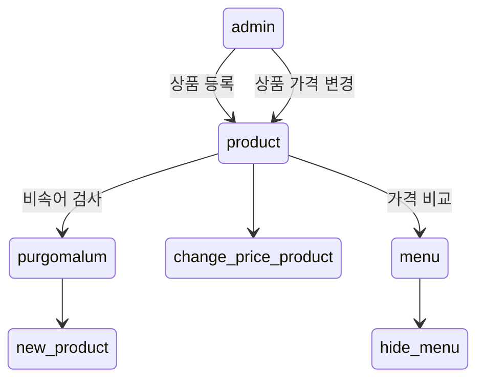
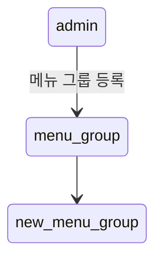
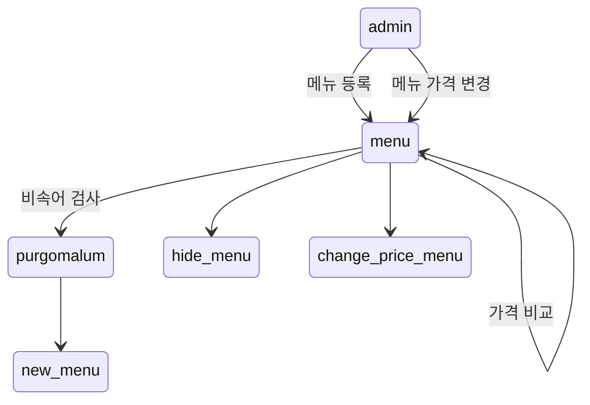
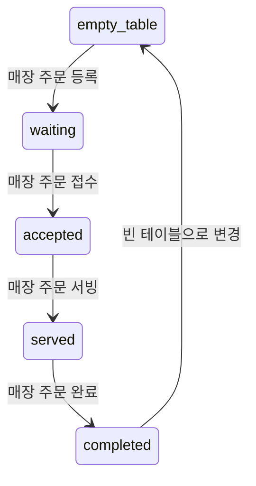
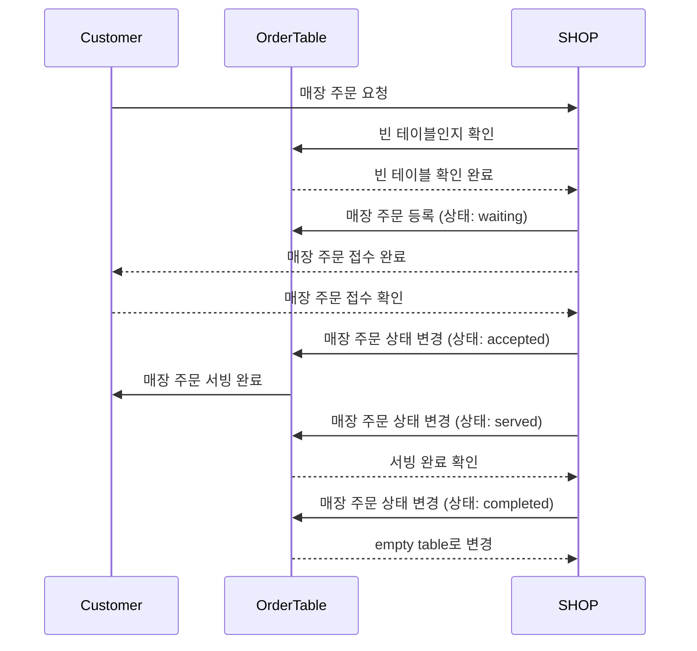
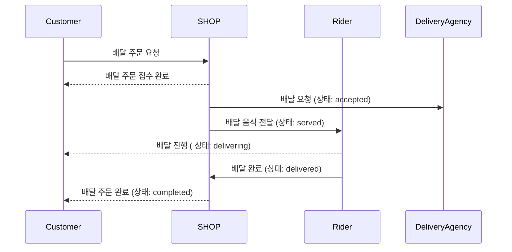
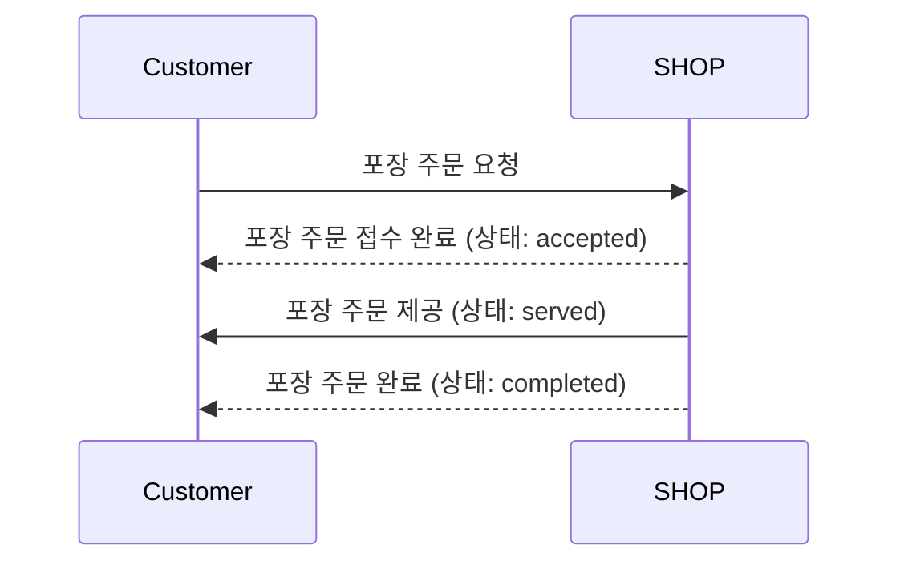

# 키친포스

## 퀵 스타트

```sh
cd docker
docker compose -p kitchenpos up -d
```

## 요구 사항

### 상품

- 상품을 등록할 수 있다.`
- 상품의 가격이 올바르지 않으면 등록할 수 없다.
    - 상품의 가격은 0원 이상이어야 한다.
- 상품의 이름이 올바르지 않으면 등록할 수 없다.
    - 상품의 이름에는 비속어가 포함될 수 없다.
- 상품의 가격을 변경할 수 있다.
- 상품의 가격이 올바르지 않으면 변경할 수 없다.
    - 상품의 가격은 0원 이상이어야 한다.
- 상품의 가격이 변경될 때 메뉴의 가격이 메뉴에 속한 상품 금액의 합보다 크면 메뉴가 숨겨진다.
- 상품의 목록을 조회할 수 있다.

### 메뉴 그룹

- 메뉴 그룹을 등록할 수 있다.
- 메뉴 그룹의 이름이 올바르지 않으면 등록할 수 없다.
    - 메뉴 그룹의 이름은 비워 둘 수 없다.
- 메뉴 그룹의 목록을 조회할 수 있다.

### 메뉴

- 1 개 이상의 등록된 상품으로 메뉴를 등록할 수 있다.
- 상품이 없으면 등록할 수 없다.
- 메뉴에 속한 상품의 수량은 0 이상이어야 한다.
- 메뉴의 가격이 올바르지 않으면 등록할 수 없다.
    - 메뉴의 가격은 0원 이상이어야 한다.
- 메뉴에 속한 상품 금액의 합은 메뉴의 가격보다 크거나 같아야 한다.
- 메뉴는 특정 메뉴 그룹에 속해야 한다.
- 메뉴의 이름이 올바르지 않으면 등록할 수 없다.
    - 메뉴의 이름에는 비속어가 포함될 수 없다.
- 메뉴의 가격을 변경할 수 있다.
- 메뉴의 가격이 올바르지 않으면 변경할 수 없다.
    - 메뉴의 가격은 0원 이상이어야 한다.
- 메뉴에 속한 상품 금액의 합은 메뉴의 가격보다 크거나 같아야 한다.
- 메뉴를 노출할 수 있다.
- 메뉴의 가격이 메뉴에 속한 상품 금액의 합보다 높을 경우 메뉴를 노출할 수 없다.
- 메뉴를 숨길 수 있다.
- 메뉴의 목록을 조회할 수 있다.

### 주문 테이블

- 주문 테이블을 등록할 수 있다.
- 주문 테이블의 이름이 올바르지 않으면 등록할 수 없다.
    - 주문 테이블의 이름은 비워 둘 수 없다.
- 빈 테이블을 해지할 수 있다.
- 빈 테이블로 설정할 수 있다.
- 완료되지 않은 주문이 있는 주문 테이블은 빈 테이블로 설정할 수 없다.
- 방문한 손님 수를 변경할 수 있다.
- 방문한 손님 수가 올바르지 않으면 변경할 수 없다.
    - 방문한 손님 수는 0 이상이어야 한다.
- 빈 테이블은 방문한 손님 수를 변경할 수 없다.
- 주문 테이블의 목록을 조회할 수 있다.

### 주문

- 1개 이상의 등록된 메뉴로 배달 주문을 등록할 수 있다.
- 1개 이상의 등록된 메뉴로 포장 주문을 등록할 수 있다.
- 1개 이상의 등록된 메뉴로 매장 주문을 등록할 수 있다.
- 주문 유형이 올바르지 않으면 등록할 수 없다.
- 메뉴가 없으면 등록할 수 없다.
- 매장 주문은 주문 항목의 수량이 0 미만일 수 있다.
- 매장 주문을 제외한 주문의 경우 주문 항목의 수량은 0 이상이어야 한다.
- 배달 주소가 올바르지 않으면 배달 주문을 등록할 수 없다.
    - 배달 주소는 비워 둘 수 없다.
- 빈 테이블에는 매장 주문을 등록할 수 없다.
- 숨겨진 메뉴는 주문할 수 없다.
- 주문한 메뉴의 가격은 실제 메뉴 가격과 일치해야 한다.
- 주문을 접수한다.
- 접수 대기 중인 주문만 접수할 수 있다.
- 배달 주문을 접수되면 배달 대행사를 호출한다.
- 주문을 서빙한다.
- 접수된 주문만 서빙할 수 있다.
- 주문을 배달한다.
- 배달 주문만 배달할 수 있다.
- 서빙된 주문만 배달할 수 있다.
- 주문을 배달 완료한다.
- 배달 중인 주문만 배달 완료할 수 있다.
- 주문을 완료한다.
- 배달 주문의 경우 배달 완료된 주문만 완료할 수 있다.
- 포장 및 매장 주문의 경우 서빙된 주문만 완료할 수 있다.
- 주문 테이블의 모든 매장 주문이 완료되면 빈 테이블로 설정한다.
- 완료되지 않은 매장 주문이 있는 주문 테이블은 빈 테이블로 설정하지 않는다.
- 주문 목록을 조회할 수 있다.

## 용어사전

### 공통

| 한글명 | 영문명      | 설명                    |
|-----|----------|-----------------------|
|매장 |shop |POS를 조작하고 상품을 판매하는 가게. 
|고객 |customer |메뉴을 주문하는 고객. 
|배달원 |rider |고객에게 배달주문을 배달하는 사람.
|비속어 |profanity |비속어로 은어, 속어등 저속한 단어를 의미함.

### 상품

| 한글명 | 영문명     | 설명                  |
|-----|---------|---------------------|
|상품 |product |메뉴를 구성할 수 있는 최소 단위. 
|가격 |price |0원 이상의 상품의 가격. 
|이름 |name |비속어가 없는 상품의 이름. 

### 메뉴 그룹

| 한글명   | 영문명        | 설명                                         |
|-------|------------|--------------------------------------------|
|메뉴 그룹 |menu group |메뉴의 개념을 그룹화 한다. 
|이름 |name |메뉴그룹의 개성을 나타내는 그룹의 이름. ex.매운치킨들, 두마리메뉴 

### 메뉴

| 한글명    | 영문명     | 설명                                     |
|--------|---------|----------------------------------------|
|메뉴 |menu |고객에게 판매되는 단위. 하나 이상의 상품으로 구성된다. 
|이름 |name |비속어가 없는 메뉴의 이름 
|가격 |price |0원 이상의 메뉴의 가격. 구성된 상품의 가격보다 크거나 같아야한다. 
|노출 |display |등록된 메뉴를 고객이 주문할 수 있는 상태를 의미한다.
|숨김 |hide |등록된 메뉴를 고객이 주문할 수 없는 상태를 의미한다.
------

### 주문 테이블

| 한글명     | 영문명              | 설명                      |
|---------|------------------|-------------------------|
|주문 테이블 |order table |고객이 매장 주문을 할 수 있는 테이블. 
|이름 |name |주문 테이블의 이름. 
|방문 손님 수 |number of guests |주문 테이블에 앉아있는 고객 수. 
|빈 테이블 |empty table |새로운 주문을 받을 수 있는 상태의 테이블 

### 주문

| 한글명   | 영문명             | 설명                      |
|-------|-----------------|-------------------------|
|주문 |order |고객이 주문한 메뉴와 수량. 
|주문 상품 |order line item |주문한 메뉴들의 수량. 
|주문 방식 |order type |고객이 주문한 방식. 배달, 포장, 매장. 
|주문 상태 |order status |주문의 진행 상태.
### 주문 상태 변경순서
- 매장/포장 : 대기 -> 접수 -> 서빙 -> 완료
- 배달 : 대기 -> 접수 -> 서빙 -> 배달중 -> 배달 완료 -> 완료

### 배달 주문

| 한글명         | 영문명              | 설명                  |
|-------------|------------------|---------------------|
|배달 주문 |delivery order |고객이 배달 주문한 주문. 
|배달 주소 |delivery address |고객이 배달 받을 주소. 
|대기 |waiting |배달 주문이 주방에 접수하기 전 대기 상태
|접수 |accepted |배달 주문을 접수한 상태. (접수와 동시에 배달 대행사로 배달원 요청을 보냄)
|서빙 |served |배달 주문의 상품들이 모두 완성된 상태
|배달중 |delivering |배달원이 주문 상품들을 픽업하여 배달이 시작한 상태
|배달완료 |delivered |고객한데 배달이 완료된 상태
|주문완료 |completed |배달주문의 모든 처리가 완료된 상태

### 포장 주문

| 한글명         | 영문명           | 설명                     |
|-------------|---------------|------------------------|
|포장 주문 |takeout order |고객이 포장 주문한 주문. 
|대기 |waiting |매장이 주문을 접수하기 전 상태
|접수 |accepted |포장 주문을 접수한 상태.
|서빙 |served |주문의 상품들이 모두 완성된 후 고객에게 제공된 상태
|주문완료 |completed |포장주문의 모든 처리가 완료된 상태

### 매장 주문

| 한글명         | 영문명          | 설명                      |
|-------------|--------------|-------------------------|
|매장 주문 |eat in order |고객이 매장에서 주문한 주문. 
|대기 |waiting |매장이 주문을 접수하기 전 상태
|접수 |accepted |매장 주문을 접수한 상태.
|서빙 |served |주문의 상품들이 모두 완성된 후 고객 주문테이블에 제공된 상태
|주문완료 |completed |매장주문의 모든 처리가 완료된 상태

## 모델링

### 상품
- `product`은 식별자와 이름, 가격을 가진다.
- `name`은 외부솔루션 `PurgomalumClient`을 통해 비속어 검사를 통과한 이름만 가질 수 있다.
- `price`은 0원 이상만 등록 가능하다.
- `product`은 `price` 0원 이상인 가격으로 변경한다.
- `price`을 변경할 때 해당 상품이 속한 메뉴들의 가격 비교 후 메뉴 가격보다 단일 상품들의 총금액이 더 비쌀 경우 해당 메뉴은 자동으로 숨김 상태로 변경된다.



### 메뉴그룹
- `menu_group`은 식별자와 이름을 가진다.
- `name`은 빈값이 아닌 이름만 가질 수 있다.



### 메뉴
- `menu`은 식별자와 이름, 가격, `menu_group`, 상태(노출/숨김), 메뉴상품들을 가진다.
- `name`은 외부솔루션 `PurgomalumClient`을 통해 비속어 검사를 통과한 이름만 가질 수 있다.
- `price`은 0원 이상만 등록 가능하다.
- `menu`은 `price` 0원 이상인 가격으로 변경한다.
- `menu`는 1개 이상의 `product`로 구성된다.
- `price`을 변경할 때 변경할 가격으로 메뉴 가격비교 후 더 비쌀 경우 자동으로 메뉴를 숨김 상태로 변경한다.



### 주문테이블

- `order_table` 는 식별자와 이름, 손님 수, 빈 테이블 여부를 가진다.
- 빈 테이블 `empty table`은 주문을 받을 수 있는 상태를 의미한다. 이 상태의 `NumberOfGuests`는 0이다.
- 방문 손님 수 `number of guests`는 주문 테이블에 앉아있는 고객 수를 의미한다.
- `eat in order` -> `waiting` -> `accepted` -> `served` -> `completed` 순으로 주문이 진행된다.
    - `completed` 이후 해당 `order_table` 은 다시 `empty table` 상태로 변경된다.



### 주문

- `order`는 주문을 의미한다. 식별자 ,`order type`,`order status`,`order line item`를 가진다
- `order`의 `order type`에 따라 추가적인 값을 가질 수 있다.
- `order status`는 주문의 진행 상태를 의미한다. `order type` 에 따라 다른 상태를 가진다.
- `order line item`은 주문된 `menu`와 수량을 의미한다.
- `order_line_item`을 가질 수 있으며 수량이 0 미만일 수 있다.
- `order_line_item`의 주문 가능한 `menu`는 `display` 상태인 메뉴이다.

### 매장 주문

- `order`의 `order type`이 `eat in order`이 매장에서 주문한 주문을 의미한다.
- `empty table` 이 있어야 주문을 등록할 수 있다.
- 주문 요청 시 `waiting` -> `accepted` -> `served` -> `completed` 순으로 주문이 진행된다.
    - `completed` 이후 사용 된 `order_table` 은 다시 `empty table` 상태로 변경된다.



### 배달 주문

- `order`의 `order type`이 `delivery order`이 배달 주문을 의미한다.
- `delivery order`는 `delivery address`를 가진다.
- 주문 요청 시 `waiting` -> `accepted` -> `served` -> `delivering` -> `delivered` -> `completed` 순으로 주문이 진행된다.
- 배달 주문이 `accepted`  시 `delivery agency`를 호출한다.



### 포장 주문

- `order`의 `order type`이 `takeout order`이 포장 주문을 의미한다.
- 주문 요청 시 `waiting` -> `accepted` -> `served` -> `completed` 순으로 주문이 진행된다.



